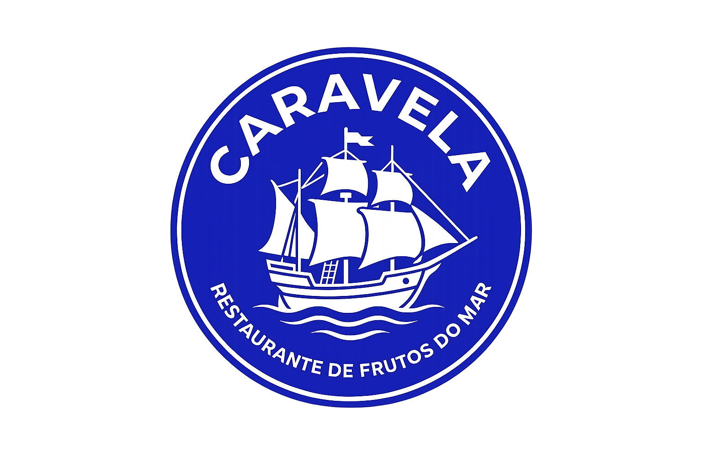
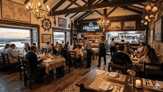
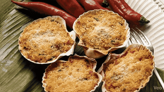
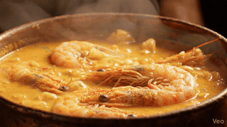
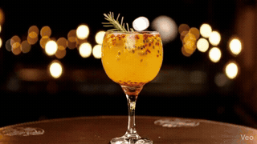

<p align="center">
  
</p>

<h1 align="center">🌊 Caravela — Menu Digital</h1>

<p align="center">
  Cardápio digital interativo e multilíngue para restaurantes de frutos do mar premium, com foco total em conversão via WhatsApp.
</p>

<p align="center">
  
  
  
  
  
  
</p>

---

## 📑 Índice

- [Sobre o Projeto](#sobre-o-projeto)
- [Demonstração](#demonstração)
- [Funcionalidades](#funcionalidades)
- [Tecnologias Utilizadas](#tecnologias-utilizadas)
- [Como Utilizar](#como-utilizar)
- [Estrutura de Pastas](#estrutura-de-pastas)
- [Onde Encontrar Ajuda](#onde-encontrar-ajuda)
- [Autor](#autor)

---

## Sobre o Projeto

**Caravela** é um cardápio digital em formato de landing page (Single Page Application), criado para substituir o cardápio tradicional em PDF, foto ou papel de um restaurante de frutos do mar.

A ideia por trás do projeto é simples: cardápios estáticos carregam devagar, não funcionam bem no celular e não geram pedido nenhum — o cliente só olha e depois chama o garçom. O Caravela resolve isso entregando uma experiência rápida, bonita e **pensada para conversão**: o cliente abre o link, navega pelas categorias, vê foto e vídeo de cada prato, filtra o que quer em segundos e finaliza o pedido ou a reserva direto no WhatsApp — sem fricção, sem cadastro, sem demora.

O projeto é 100% front-end (HTML, CSS e JavaScript puro, sem frameworks ou build), o que o torna leve, fácil de hospedar e simples de manter mesmo para quem não é desenvolvedor.

---

## Demonstração

GitHub não reproduz arquivos `.mp4` direto no README, então os vídeos abaixo foram convertidos para GIF apenas para esta prévia — na aplicação real eles tocam como vídeo nativo (mais leve e com melhor qualidade).

**Seção introdutória** — vídeo institucional em loop no fundo do hero (vídeos desenvolvidos com Inteligência Artificial):

<p align="center"></p>

**Mídia reativa nos cards** — o vídeo do prato/drink dispara automaticamente ao passar o mouse (ou tocar, no mobile):

<table>
<tr>
<td align="center"><br><sub>Casquinha de Siri</sub></td>
<td align="center"><br><sub>Moqueca Baiana</sub></td>
<td align="center"><br><sub>Gin Tropical</sub></td>
</tr>
</table>

> 💡 Os arquivos de vídeo originais (`.mp4`, em alta qualidade) ficam na pasta `vid/` do projeto e são os realmente usados pelo `index-v2.html`. Os GIFs em `assets/readme/` existem só para esta documentação.

---

## Funcionalidades

- 🌐 **Internacionalização (i18n):** alternância instantânea entre **Português, Inglês e Espanhol**, sem recarregar a página.
- 🔍 **Busca dinâmica em tempo real:** filtra os cards do cardápio conforme o usuário digita, ocultando itens não correspondentes com transição suave.
- 🎬 **Mídia reativa:** cada prato/drink tem um vídeo curto em loop que é disparado automaticamente ao passar o mouse (desktop) ou tocar na tela (mobile), pausando ao perder o foco para economizar processamento e dados.
- 🧭 **Scroll Spy:** a barra de categorias destaca automaticamente a seção que está sendo visualizada conforme o usuário rola a página.
- ✨ **Reveal on Scroll:** animações de entrada (fade + subida) acionadas via `IntersectionObserver` nativo, sem bibliotecas externas.
- 🪟 **Modais de customização:** telas sobrepostas para detalhar opções de drinks, cervejas, refrigerantes, águas e bebidas sem álcool.
- 💬 **Integração com WhatsApp:** botão flutuante fixo + atalhos no cabeçalho e no rodapé, todos via `wa.me`, garantindo que o cliente esteja sempre a um toque de fechar o pedido.
- 📞 **Discagem direta:** link `tel:` para quem prefere ligar e fazer reserva.
- 📱 **Layout responsivo mobile-first:** 1 coluna no celular, grid de 2 colunas no tablet e múltiplas colunas no desktop.
- 🚢 **Splash screen personalizada** com a marca do restaurante e loader animado na primeira renderização.

---

## Tecnologias Utilizadas

- **HTML5** semântico
- **CSS3** — variáveis nativas (Custom Properties), Flexbox, Grid, transições e animações
- **JavaScript** puro (Vanilla JS) — manipulação de DOM, `IntersectionObserver`, eventos de hover/touch
- **[Google Fonts](https://fonts.google.com/)** — Cormorant Garamond (títulos) e DM Sans (textos)
- **[Font Awesome 6](https://fontawesome.com/)** — ícones de navegação e redes sociais
- **[FlagCDN](https://flagcdn.com/)** — bandeiras para o seletor de idiomas
- **WhatsApp Business API** (`wa.me`) e protocolo `tel:` — integrações de contato e conversão

---

## Como Utilizar

Por ser um projeto 100% estático (sem back-end, sem dependências de build), não é necessário instalar nada para rodá-lo.

1. **Clone o repositório**
   ```bash
   git clone https://github.com/Daniel-RPS/caravela-menu-digital.git
   cd caravela-menu-digital
   ```

2. **Abra o arquivo `index-v2.html`**
   - Pode ser aberto direto no navegador (duplo clique), ou
   - Servido localmente com a extensão **Live Server** (VS Code) para ter recarregamento automático.

3. **Personalize para o seu negócio**
   - Número de WhatsApp/telefone: procure por `wa.me/+55...` e `tel:+55...` no HTML.
   - Preços e nomes dos pratos: editáveis diretamente nos cards de cada categoria.
   - Textos em outros idiomas: ajustáveis no objeto `translations`, dentro do `<script>` do arquivo.
   - Imagens e vídeos: substitua os arquivos nas pastas `img/` e `vid/` mantendo os mesmos nomes referenciados no HTML (ou atualize os caminhos).

4. **Publique**
   - Como é um site estático, pode ser hospedado gratuitamente em **GitHub Pages**, **Netlify** ou **Vercel**.

---

## Estrutura de Pastas

```
caravela-menu-digital/
├── index-v2.html        # Página única (SPA) com HTML + CSS + JS
├── img/                  # Logo e fotos dos pratos/bebidas (.jpg, .png)
├── vid/                  # Vídeos curtos em loop de cada prato/drink (.mp4)
└── assets/readme/        # GIFs usados só na seção "Demonstração" deste README
```

---

## Onde Encontrar Ajuda

Encontrou um problema ou tem uma sugestão de melhoria?

- Abra uma **[Issue no repositório](../../issues)** descrevendo o que aconteceu.
- Ou entre em contato diretamente comigo pelos canais listados na seção [Autor](#autor).

---

## Autor

**Daniel Ribeiro**

- GitHub: [@Daniel-RPS](https://github.com/Daniel-RPS)

Feito com 🦐 e 🌊 para o segmento gastronômico premium.
